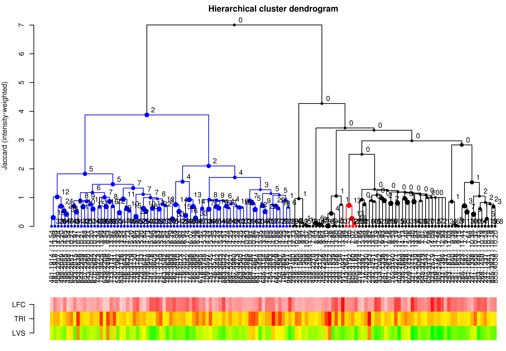

# MetFamily
Version: 1.0.2

## Short description

Identification of regulated metabolite families.

## Description

The MetFamily web application is designed for the identification of regulated metabolite families. This is possible on the basis of metabolite profiles for a set of MS features as well as one MS/MS spectrum for each MS feature. Group-discriminating MS features are identified using a principal component analysis (PCA) of metabolite profiles and metabolite families are identified using a hierarchical cluster analysis (HCA) of MS/MS spectra. Regulated metabolite families are identified by considering group-discriminating MS features from corporate metabolite families.

## Tool Authors 
- [Hendrik Treutler](https://github.com/treutler) (IPB-Halle)

## Container Contributors
- [Kristian Peters](https://github.com/korseby) (IPB-Halle)

## Website
* http://msbi.ipb-halle.de/MetFamily/
* https://github.com/Treutler/MetFamily

## Git Repository

- https://github.com/phnmnl/container-metfamily.git

## Installation 

For local individual installation:

```bash
docker pull docker-registry.phenomenal-h2020.eu/phnmnl/metfamily
```

## Usage Instructions

For direct docker usage:

```bash
docker run docker-registry.phenomenal-h2020.eu/phnmnl/metfamily ...
```

For launchin with traefik:

```bash
docker-compose -f traefik/docker-compose.yaml up -d
curl -H Host:metfamily.docker.localhost http://localhost:80
```

## Publications

Treutler H, Tsugawa H, Porzel A, Gorzolka K, Tissier A, Neumann S, Balcke GU (2016): Discovering Regulated Metabolite Families in Untargeted Metabolomics Studies. Anal Chem 88(16):8082-90. doi:10.1021/acs.analchem.6b01569
